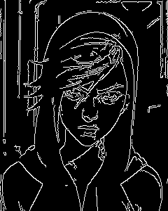
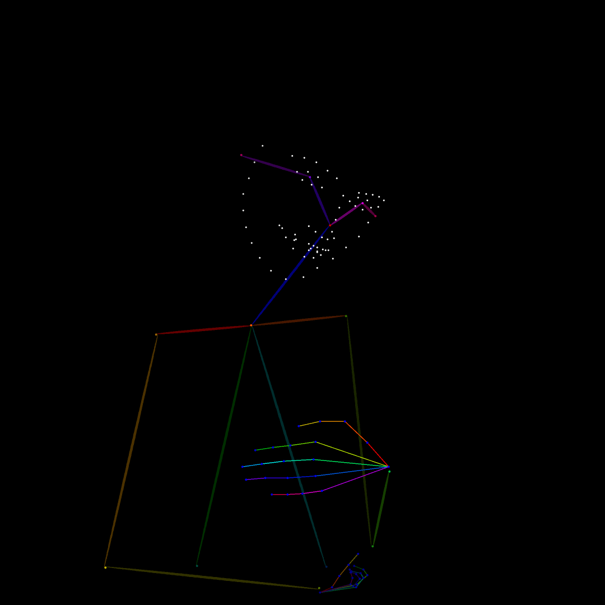
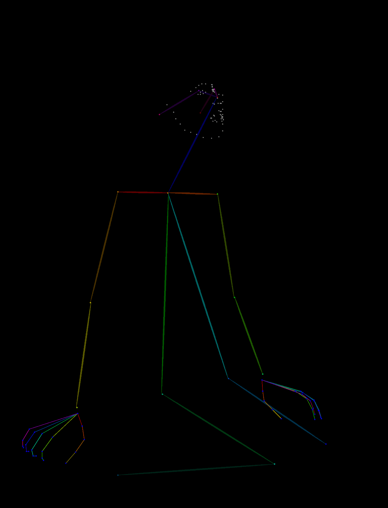
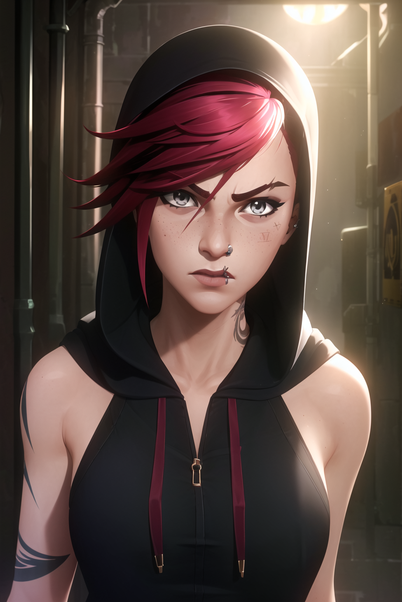

# Spatio-Temporal Energy-Guided Diffusion Model for Zero-Shot Video Synthesis and Editing

## Abstract

Diffusion-based generative models have exhibited considerable success in conditional video synthesis and editing. Nevertheless, prevailing video diffusion models primarily rely on conditioning with specific input modalities, predominantly text, restricting their adaptability to alternative modalities without necessitating retraining of modality-specific components. In this work, we present EnergyViD, a universal spatio-temporal Energy-guided Video Diffusion model designed for zero-shot video synthesis and editing across diverse conditions. Specifically, we leverage off-the-shelf pre-trained networks to construct generic energy functions, guiding the generation process under specific conditions without the need for retraining. To precisely capture temporal dynamics related to motion conditions (e.g., pose sequences), we introduce a novel kernel Maximum Mean Discrepancy (MMD)-based energy function, which minimizes the global distribution discrepancy between the conditioning input and the generated video. Our extensive qualitative and quantitative experiments demonstrate that our algorithm consistently produces high-quality results across a wide range of motion and non-motion conditions, including text, face ID, style, poses, depths, sketches, canny edges, and segmentation maps, in the context of zero-shot video synthesis and editing. We will release source code upon acceptance of the paper.

**Author List**

[Ling Yang](https://yangling0818.github.io/),[Yikai Zhao](https://pkuzhao.net/),[Zhaochen Yu](https://zhaochenyu0201.github.io/),[Bohan Zeng](https://scholar.google.com/citations?user=MHo_d3YAAAAJ&hl=en),[Minkai Xu](https://minkaixu.com/),[Shenda Hong](https://hsd1503.github.io/),[Bin Cui](https://cuibinpku.github.io/)

> **Peking University, Stanford University**

## More generation results
Here we present more generation results based on **Stable-Video-Diffusion**.
## Canny Edge 
| **Condition**                                | **Video**                    |
| -------------------------------------------------- | ------------------------------- |
|  |  |
|  |  |

## Pose Sequence 
| **Condition**                                      | **Video**                          |
| ----------------------------------------------------------- | ------------------------------------- |
|              |          |
|  |  |
## Depth Map 
| **Condition**                                  | **Video**                      |
| --------------------------------------------------- | --------------------------------- |
|  |  |
|        |      

## Comparison With SOTA method ControlNeXt

Here we compare our method with SOTA method ControlNeXt in pose and face condition.

<video src=".\assets\Comparison\case1.mp4"></video>

<video src=".\assets\Comparison\case2.mp4"></video>

<video src=".\assets\Comparison\case3.mp4"></video>

## **Analysis on Failure Cases**

Here we choose one representative example that has conflicts between input conditions, including **face id,  text prompt.** Specifically, for face id, we choose a character in anime style while the text prompt requires the generated video should be in realistic style. These two input conditions are thus contradictory to each other.

|  |prompt: A girl is dancing, realistic style. |
| ------------------------------------------------------------ | ------------------------------------------------------------ |

We observed that under conflicting conditions, the generated results exhibit unstable variations and  artifacts in the details. However, the overall consistency of the generated videos remains satisfactory, demonstrating the temporal robustness of our method when confronted with conflicting conditions. In future work, we will conduct more detailed explorations of multi-condition controlled generation to ensure robust performance even in the presence of mutually contradictory conditions.
